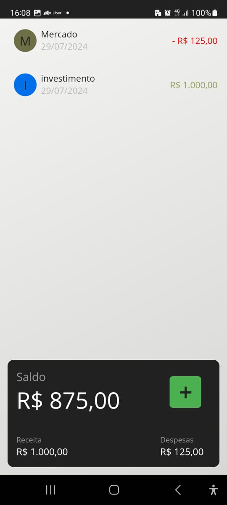
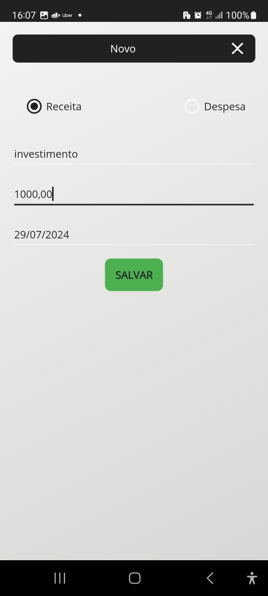
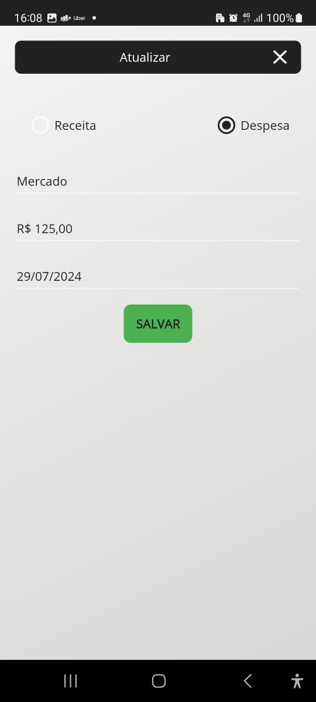

# AppControleFinanceiro


## Descrição

AppControleFinanceiro é um aplicativo de controle financeiro desenvolvido com .NET MAUI, Este projeto foi feito para fins de estudo, utilizando a versão .NET 7.

## Requisitos

- [.NET 7 SDK](https://dotnet.microsoft.com/download/dotnet/7.0)
- [Visual Studio 2022](https://visualstudio.microsoft.com/vs/)

## Instalação

1. Clone o repositório:

    ```sh
    git clone https://github.com/LucasBLs/AppControleFinanceiro.git
    cd AppControleFinanceiro
    ```

2. Abra o projeto no Visual Studio 2022.

3. Restaure as dependências do projeto:

    ```sh
    dotnet restore
    ```

4. Compile e execute o projeto:

    - Selecione o dispositivo ou emulador desejado.
    - Clique em **Run** ou pressione **F5** para iniciar o aplicativo.

## Estrutura do Projeto

- **AppControleFinanceiro**: Contém o código principal do aplicativo de controle financeiro desenvolvido com .NET MAUI.

## Tecnologias Utilizadas

- **.NET MAUI**: Framework para desenvolvimento de aplicativos multiplataforma.
- **C#**: Linguagem de programação utilizada.
- **LiteDB**: Banco de dados NoSQL leve utilizado para armazenamento local de dados.

## Demonstração

Algumas capturas de tela do aplicativo:





## Contribuição

Contribuições são bem-vindas! Sinta-se à vontade para abrir issues e pull requests.

## Licença

Este projeto está licenciado sob a licença MIT. Veja o arquivo [LICENSE](LICENSE) para mais detalhes.
